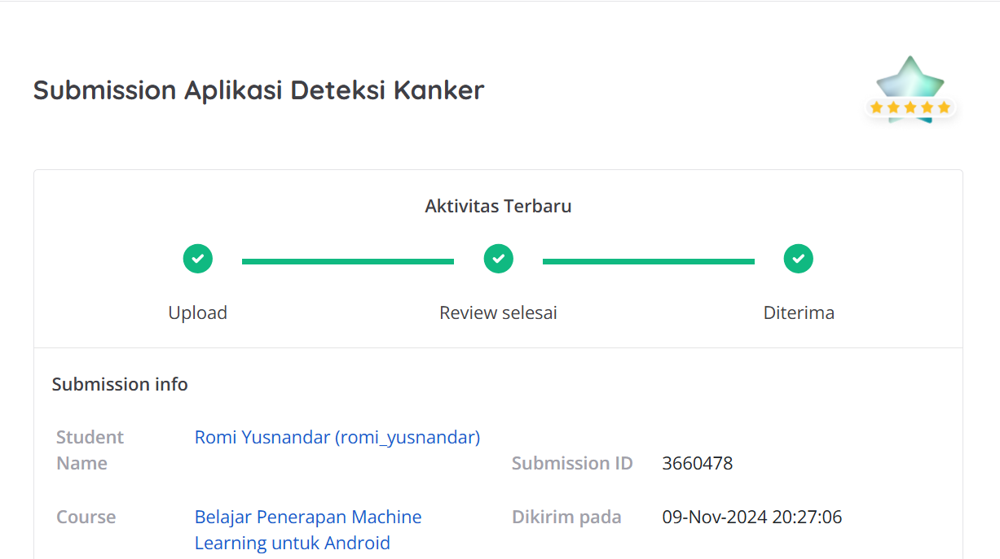
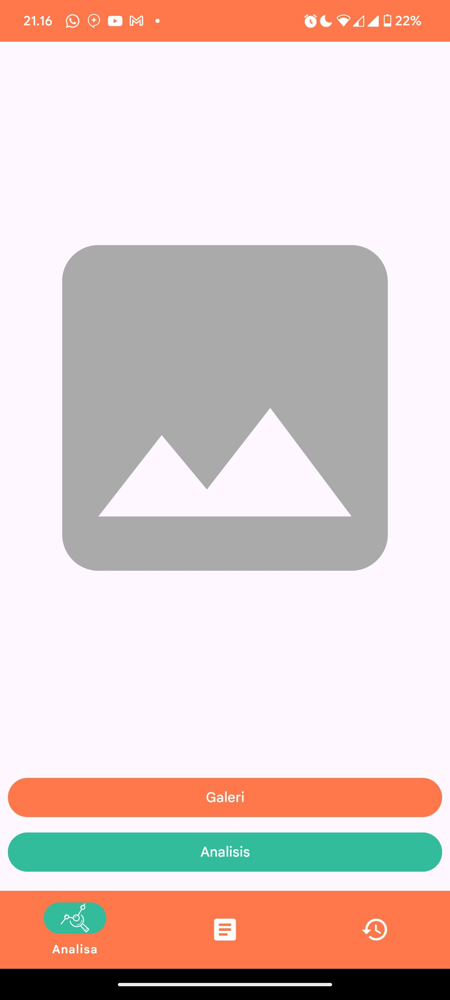
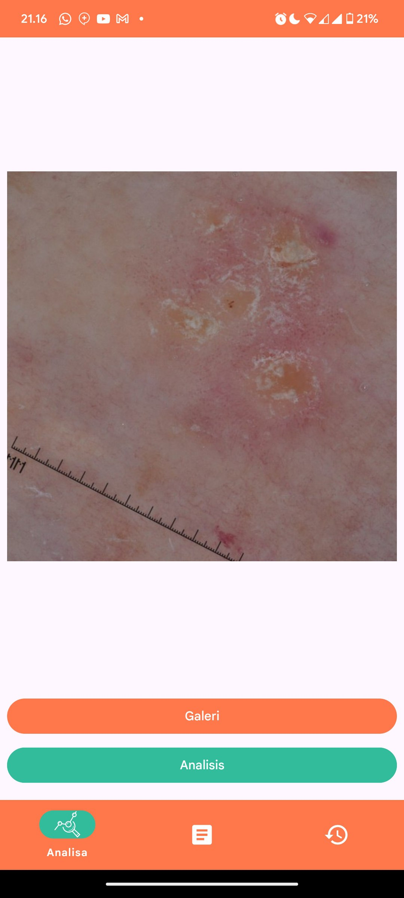
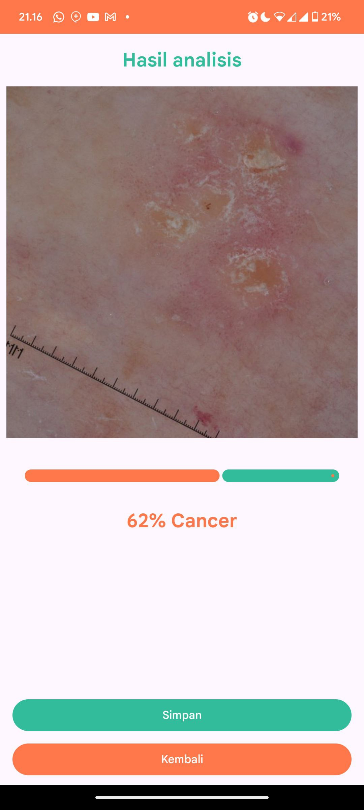
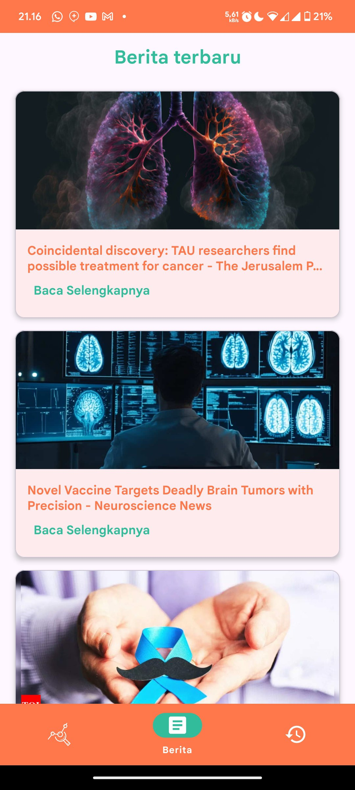
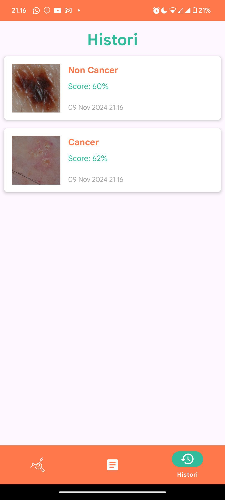

<div align="center">
    <h1>Skin Cancer Detector</h1>
    <p>The application to detect skin cancer using AI assistance.<br></p>
</div>

<p align="center">
  
</p>

## Table of Contents
- [Table of Contents](#table-of-contents)
- [Installation](#installation)
- [App Preview](#app-preview)
- [Dependencies](#dependencies)


## Installation
Clone the repository or Download the zip & Open it into Android Studio
```bash
    https://github.com/romiyusnandar/skin_cancer_detector.git
```

## App Preview
<div style="overflow-x: auto; white-space: nowrap;">
    
    
    
    
    
</div>
<br>

## Dependencies
- [Lifecycle & Livedata](https://developer.android.com/jetpack/androidx/releases/lifecycle): Observing Android component lifecycles and managing continuous data flow.
- [ViewModel](https://developer.android.com/topic/libraries/architecture/viewmodel): Storing and managing UI-related data in a lifecycle-conscious way.
- [Retrofit 2](https://square.github.io/retrofit/): Making HTTP requests to RESTful APIs in a simple and efficient way on Android.
- [OkHttp 3](https://square.github.io/okhttp/): Efficient and reliable HTTP client for Android, used by Retrofit for making HTTP network calls.
- [Glide](https://github.com/bumptech/glide): Library for smoothly and efficiently displaying images on Android.
- [AndroidX](https://mvnrepository.com/artifact/androidx): Package of libraries and tools that provide a range of features for Android app development.
- [KotlinX Coroutines](https://developer.android.com/kotlin/coroutines): Kotlin library for writing asynchronous code in a clean, sequential style.
- [RoomDatabase](https://developer.android.com/reference/android/arch/persistence/room/RoomDatabase): Library for local data storage on Android, based on the SQLite database architecture.
- [DataStore](https://developer.android.com/topic/libraries/architecture/datastore): Replaces SharedPreferences, providing a secure and asynchronous data storage system using a standard protocol.
- [ViewBinding](https://developer.android.com/topic/libraries/view-binding): Allows binding of Android UI components to code via the IDs present in layout files.
- [UCrop](https://github.com/Yalantis/uCrop): Library for performing image cropping in Android apps with a user-friendly interface.
- [Tensorflow Lite](https://central.sonatype.com/artifact/org.tensorflow/tensorflow-lite-task-vision): Machine learning framework used for building, testing, and deploying ML models efficiently on Android devices.